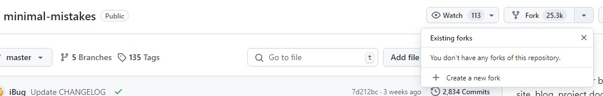
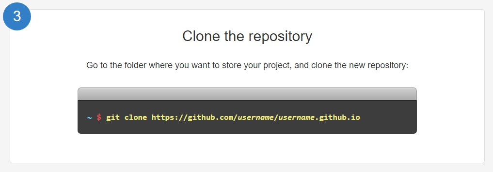

##### GitPage Blog를 만든 과정 및 에러와 참고한 레퍼런스들을 정리 해보려고 한다. #####


### 1. GitHubPage 만들기 과정 ###

##### 1.1 Repository Fork #####

<span style="font-size: 18px;">테마는 minimal-mistakes를 사용했다.</span>
[github.mmistakes](https://github.com/mmistakes/minimal-mistakes)

<span style="font-size: 18px;">해당 레포지토리 Fork 진행.</span>



<span style="font-size: 18px;"> 이때 이름은 Username.github.io 양식을 지켜야 한다. </span>


##### 1.2 Repository Clone, Push #####

<span style="font-size: 18px;">Repository Clone으로 로컬을 만든다.</span>


[이미지 캡처 출처](https://pages.github.com/)<span style="font-size: 18px;"> - gitpage 만들기 git 기본 안내글</span>  


```
Clones a repository into a newly created directory, creates remote-tracking branches for each branch in the cloned repository (visible using git branch --remotes), and creates and checks out an initial branch that is forked from the cloned repository’s currently active branch.

After the clone, a plain git fetch without arguments will update all the remote-tracking branches, and a git pull without arguments will in addition merge the remote master branch into the current master branch, if any (this is untrue when --single-branch is given; see below).

This default configuration is achieved by creating references to the remote branch heads under refs/remotes/origin and by initializing remote.origin.url and remote.origin.fetch configuration variables.'

-git clone에 대한 설명
```


##### 1.3 config.yml 파일 수정 #####

<span style="font-size: 18px;">받아온 파일 중 config.yml 파일이 있다.  </span>

<span style="font-size: 18px;">minimal-mistakes 테마의 컨피그 파일인데 그중 url은 반드시 제대로 수정해줘야  </span>
<span style="font-size: 18px;">GitHubPage가 제대로 뜨게 되니 유의.</span>

```python
url : "https://username.github.io"
```
  

<span style="font-size: 18px;">나머지 confing에 대해선 테마의 Guide 참조.  </span>
[mmistakes.Guide](https://mmistakes.github.io/minimal-mistakes/docs/configuration/)


<span style="font-size: 18px;">여끼까지 진행만 하면 일단 GitPage 자체는 문제 없이 로딩 된다.  </span>
<span style="font-size: 18px;">하지만 변경사항이 생길때마다 commit과 build를 반복해야하는 문제가 있다.</span>

### 2. 로컬 개발 환경 설정 ###

##### 2.1 Jekyll 다운로드 #####

<span style="font-size: 18px;">GithubPage의 대부분의 테마는 Jekyll을 사용한다.</span>
```
Jekyll is a static site generator. It takes text written in your favorite markup language and uses layouts to create a static website. You can tweak the site’s look and feel, URLs, the data displayed on the page, and more.
```
<span style="font-size: 18px;">Jekyll Quickstart - </span>[jekyllrb.com](https://jekyllrb.com/docs/)

<span style="font-size: 18px;">Jekyll은 Ruby 기반이라 Ruby 먼저 설치해야 한다.  </span>
<span style="font-size: 18px;">루비 다운로드 - </span>[rubyinstall](https://rubyinstaller.org/downloads/)

<span style="font-size: 18px;">Ruby만 다운받으면 Jekyll은 통해서 다운로드 받을 수 있다.  </span>
<span style="font-size: 18px;">Jekyll 다운로드 참조 - </span>[Jekyll](https://jekyllrb.com/docs/installation/)


##### 2.2 로컬 실행 #####

<span style="font-size: 18px;">cmd 실행 후 로컬의 위치로 간다.</span>

<span style="font-size: 18px;">bundle install</span>

<span style="font-size: 18px;">bundle exec jekyll serve 를 차례로 실행한다.</span>

<span style="font-size: 18px;">http://127.0.0.1:4000/로 접속하여 로컬에서 변경 사항을 확인 할 수 있다.  </span>

- 첫 실행시 문제가 없었으나 재실행시 오류가 발생했다.  
    - minimal-mistakes-jekyll.gemspec: No such file or directory 오류.
    - gemfile 내부의 gemspec을 gemspecs로 변경.
    - Gemfile에 gem "minimal-mistakes-jekyll" 추가.
    - cmd에 "bundle" 입력. (해결)


### 3. 번외 에러 ###

<span style="font-size: 18px;">minmal-mistakes 테마를 사용하기 전에 chirpy 테마를 사용하려고 했었다.  </span>
<span style="font-size: 18px;">해당 테마 적용 과정에서 생긴 에러 몇개에 대한 과정을 정리해둔다.</span>


<span style="font-size: 18px;">/bundle install 중 에러  
</span>
<span style="font-size: 18px;">GIthub Jekyll Repository의 issue탭을 보고 문제를 해결했다.  </span>
```
wdm-0.1.1/gem_make.out
```

```js
gem install wdm -- --with-cflags=-Wno-implicit-function-declaration (실패)

ruby 최신 버전에서 v3.1.6 다운그레이드 (실패)

gemfile 내 gem "wdm", "~> 0.1.1", :platforms => [:mingw, :x64_mingw] 구문 주석처리 (성공)
```


<span style="font-size: 18px;">페이지 —layout: home # Index page — 만 보이는 이슈</span>
```js
bundle lock --add-platform x86_64-linux 실행
Bulid and development 에서 Source를 Github Actions 로 변경 이후, jekyll.yml 커밋
```

<span style="font-size: 18px;">해당 블로그 참조 - </span>[friendyvillain](https://friendlyvillain.github.io/posts/chirpy-setup/)